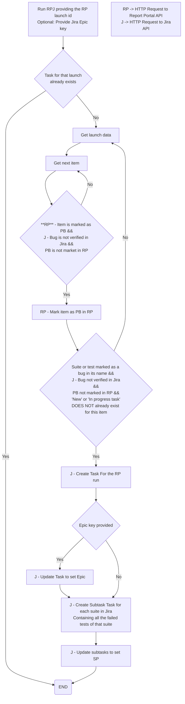

# RPJ | Report portal to Jira

RPJ is a tool for automatically synchronizing items between Report Portal and Jira, creating tasks and subtasks in Jira
from failed items in Report Portal launches.

<details><summary> <b>How does it work?</b></summary>



</details>


# Configuration

### Environment Variables

These variables should be set in your environment before running the tool:

- `REPORT_PORTAL_TOKEN`: The access token for Report Portal.
- `REPORT_PORTAL_API_URL`: The API URL for Report Portal.
- `REPORT_PORTAL_PROJECT`: The name of the project in Report Portal.
- `JIRA_ACCESS_TOKEN`: The access token for Jira.
- `JIRA_API_URL`: The API URL for Jira.
- `JIRA_PROJECT`: The name of the project in Jira.
- `OWNERS`: A JSON string representing the owners for different test suites.
  - **key**: Name of test suite
  - **value**: Owner's Jira username

### Example Configuration

```env
REPORT_PORTAL_TOKEN=ZZZZZZ65431
REPORT_PORTAL_API_URL=https://my.report.portal.com/api/v1
REPORT_PORTAL_PROJECT=RPJ
JIRA_ACCESS_TOKEN=XXXXX123456
JIRA_API_URL=https://my.jira.cin/rest/api/2
JIRA_PROJECT=RPJ
OWNERS = {
    "Credentials Suite": "jane-doe",
    "Login validation": "john-doe",
    "Pagination validations": "smith"
}
```

# Usage

## Creating Jira Tickets from Report Portal Launches

Once the project has been deployed, you can create Jira tickets from a launch in Report Portal. To do this, make a
request to the base URL where the project is deployed, appending the ID of the launch for which you want to create
tasks.

**Basic Example:**

```
https://url-to-the-tool/{launch_id}
```

Where `{launch_id}` is replaced by the actual launch ID.

For example, here, 1234 is the ID of the launch.:

```
https://url-to-the-tool/1234
```

## Creating a Task under a Specific Epic

If you want to create the task under a specific epic, you can specify a query parameter epic with the code of the
desired epic.

**Example with Epic:**

```
https://url-to-the-tool/{launch_id}?epic={epic_code}
```

Where `{epic_code}` is replaced by the actual Epic code.

For example, here, XX-11 is the code of the epic.:

```
https://url-to-the-tool/1234?epic=XX-11
```

# Roadmap

- [x] Get last launch and/or by id
- [x] Get items of launch
- [x] Group items by test suite
- [x] Create a Jira Task for each suite
- [x] Create a task for the launch and subtasks for each failed suite
- [x] Check if a Jira Task for that run is already created before creating one
- [x] Create an endpoint to trigger the execution
- [x] Create a DockerFile for the project
- [x] Create JSON file to associate features to owners
- [x] Add user guide to README
- [X] Filter tests that are affected by bugs to avoid creating tasks
- [ ] Add an env variable to map custom jira fields to usable names
- [ ] Add husky with lint-stage to enforce linting
- [ ] Add time mark to logs
- [ ] Include spec name in task description
- [ ] Add item logs to the task description
- [ ] Reduce calls to Jira API by keeping a cache of issues queried

# Install

1. Clone the repository
2. Docker build and Docker run setting env variables

# Build

```bash
npm run build
```

# Execute

```bash
npm run start
```
